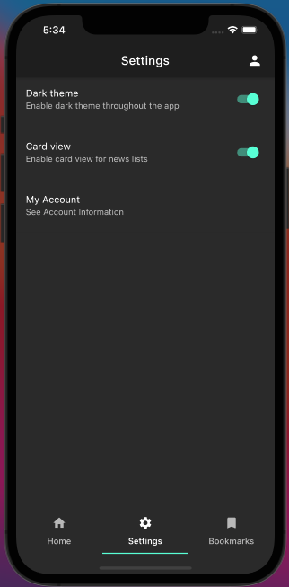
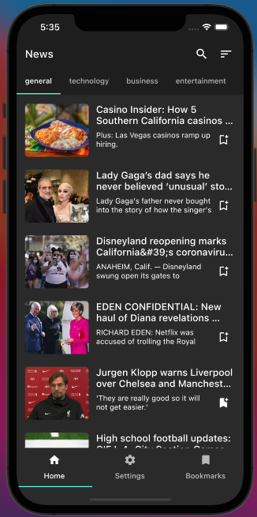
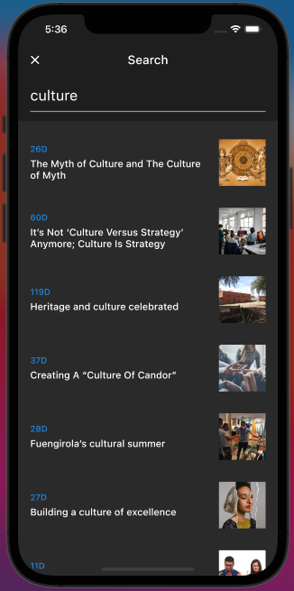

# flutter_news
This is a Flutter app for watching news it makes use of the mediaStack API

## Watch recent news on the home screen

## Adjust app to your preferences

## Light Mode for more brightness

## Wanna see more at once? enable list view

## Search for relevant keywords

## Bookmark news for later

